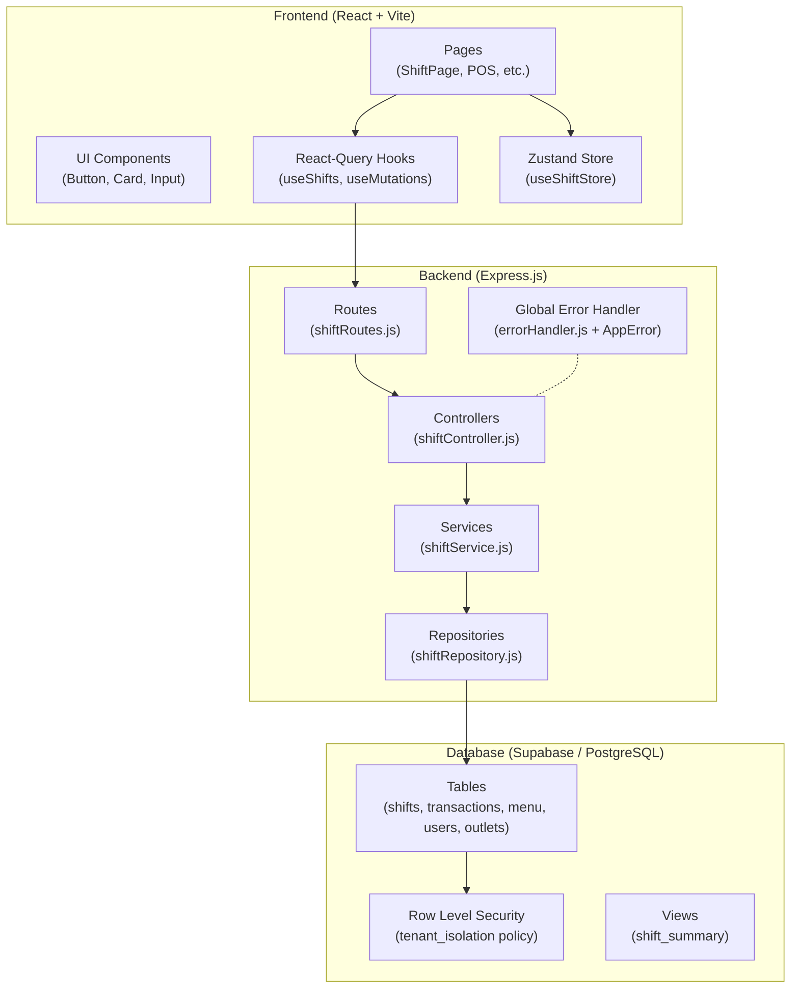

# ☕ KEN COFFEE ROASTERS — Enterprise POS System

> **Full-Stack Coffee Shop Management System** built with React + Express + Supabase.
> Designed for scalable Multi-Tenant operations following Clean Architecture principles.

---

## 🏗️ Architecture Overview



---

## 📂 Project Structure

```
Coffeeshop/
├── frontend/                     # React + Vite (SPA)
│   ├── src/
│   │   ├── components/ui/        # Reusable UI (Button, Card, Input)
│   │   ├── hooks/                # React-Query custom hooks
│   │   ├── pages/                # Route-level pages
│   │   ├── stores/               # Zustand state management
│   │   └── lib/                  # Utilities (cn, formatCurrency)
│   ├── .storybook/               # Storybook configuration
│   └── vite.config.js
│
├── backend/                      # Express.js API Server
│   └── src/
│       ├── routes/               # HTTP route definitions
│       ├── controllers/          # Request/response handling
│       ├── services/             # Business logic & validation
│       ├── repositories/         # Supabase data access layer
│       ├── middleware/           # Auth, error handler
│       └── utils/                # AppError, helpers
│
├── .github/workflows/ci.yml     # GitHub Actions CI pipeline
├── MASTER_GO_LIVE_SCHEMA.sql     # Production database schema
└── supabase_security_migration.sql  # RLS & soft-delete migration
```

---

## 🛡️ Security Model

| Layer | Mechanism | Description |
|-------|-----------|-------------|
| **Database** | Row Level Security (RLS) | Every table enforces `tenant_id` isolation via PostgreSQL policies |
| **Backend** | JWT Token Validation | `tenant_id` extracted from JWT, passed through Controller → Service → Repository |
| **Backend** | AppError + Global Handler | Centralized error catching prevents information leakage |
| **Data** | Soft-Delete (`is_active`) | Financial records are never physically deleted |

---

## 🎨 Design System

- **Color Palette**: Zinc spectrum (base) + Amber (accent)
- **Grid System**: Strict 8px multiples
- **Typography**: Inter (labels) + JetBrains Mono (numbers/currency)
- **Dark Mode**: Full adaptive support with semantic CSS variables
- **Components**: Documented in Storybook (`npm run storybook`)

---

## 🚀 Quick Start

### Prerequisites
- Node.js 20+
- Supabase project (with schema applied)

### Installation

```bash
# Clone the repository
git clone <repo-url>
cd Coffeeshop

# Install frontend dependencies
cd frontend && npm install

# Install backend dependencies
cd ../backend && npm install
```

### Running Locally

```bash
# Terminal 1: Start backend
cd backend && npm run dev

# Terminal 2: Start frontend
cd frontend && npm run dev

# Terminal 3: (Optional) Start Storybook
cd frontend && npm run storybook
```

### Environment Variables

Create a `.env` file in the root directory:

```env
SUPABASE_URL=https://your-project.supabase.co
SUPABASE_KEY=your-anon-key
JWT_SECRET=your-jwt-secret
PORT=3000
```

---

## ✅ CI/CD Pipeline

GitHub Actions runs automatically on every push to `main` or `develop`:

1. **Lint** — ESLint checks for code quality
2. **Test** — Vitest runs all unit tests
3. **Build** — Vite production build validation

---

## 📋 License

Proprietary — KEN Enterprise © 2026
