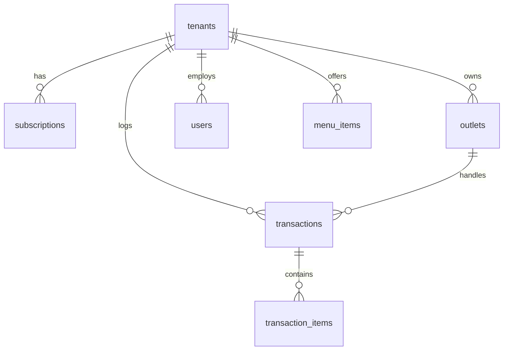

# 👑 KEN ENTERPRISE — ARCHITECTURAL BLUEPRINT v1.0
> **SaaS Multi-Tenant Architecture: Repository Structures & Database Schema**

This document serves as the official blueprint and goal guide for transition towards a secure, high-velocity SaaS Multi-Tenant architecture.

---

## 🏛️ I. REPOSITORY ARCHITECTURE

To achieve ultimate visual stability, high transaction throughput, and data isolation, the platform is divided into **5 distinct control and data planes**.

```mermaid
graph TD
    subgraph Control Plane (SaaS Owner)
        A[saas-super-admin] -->|Provision & License| DB[(Supabase Shared Database)]
    end
    subgraph Data Plane (Merchant Operations)
        B[saas-core-backend] -->|Core API Engine & RLS| DB
        C[pos-client] -->|Cashier POS & KDS Dapur| B
        E[merchant-office] -->|Menu, Stocks, Financials| B
    end
    subgraph Public Plane (Customer Self-Order)
        D[customer-portal] -->|Scan QR Ordering| B
    end
```

### 1. `saas-core-backend` (Core API Engine)
*   **Purpose**: Single, high-performance API serving all client applications.
*   **Tech Stack**: Node.js, Express/NestJS, Supabase Admin SDK, Redis Caching.
*   **Security**: Enforces JWT verification and maps claims to database Row Level Security (RLS) policies.

### 2. `saas-super-admin` (SaaS Control Portal)
*   **Purpose**: Used exclusively by the platform owner to manage registered merchants, packages, and billing status.
*   **Tech Stack**: React/Next.js (Secure Domain: `admin.platform.com`).

### 3. `pos-client` (Cashier POS & KDS Dapur)
*   **Purpose**: Critical transaction interface at outlets. Highly optimized for cashier checkouts and live kitchen displays. Needs to be extremely robust, fast, and offline-capable.
*   **Tech Stack**: React.js SPA (Vite PWA / IndexedDB for Offline Sync).

### 4. `merchant-office` (Merchant Back-Office Dashboard)
*   **Purpose**: Administrative dashboard for business owners and store managers to oversee menus, manage inventory (stok opname), view profit/loss reports, and run heavy accounting data aggregations.
*   **Tech Stack**: React.js SPA (Vite / TailwindCSS).

### 5. `customer-portal` (QR Ordering PWA)
*   **Purpose**: Public-facing ordering app optimized for mobile screen speeds and fast loading.
*   **Tech Stack**: Next.js (SSR) / lightweight PWA.

---

## 🚀 II. DEPLOYMENT & REPOSITORY MAPPING

To keep codebase management transparent, here is the mapping of GitHub repositories to Vercel/Cloud deployment targets:

### 1. Codebase Repositories (GitHub)
*   **Total Repositories**: **5 repositories** (or **1 Monorepo** containing 5 distinct workspace folders).
    1.  `saas-core-backend` (Express API Server)
    2.  `saas-super-admin` (Platform Owner Portal)
    3.  `pos-client` (Cashier POS & KDS Dapur)
    4.  `merchant-office` (Merchant Admin Back-Office)
    5.  `customer-portal` (Scan QR Self-Order)

### 2. Live Hosting Matrix (Vercel & Cloud)

```mermaid
graph LR
    subgraph GitHub
        R1[saas-core-backend]
        R2[saas-super-admin]
        R3[pos-client]
        R4[merchant-office]
        R5[customer-portal]
    end
    subgraph Vercel Deployments
        R2 -->|Deploy| V1[admin.platform.com]
        R3 -->|Deploy| V2[pos.platform.com]
        R4 -->|Deploy| V3[office.platform.com]
        R5 -->|Deploy| V4[order.platform.com]
    end
    subgraph Persistent Server (Render/Railway/VPS)
        R1 -->|Deploy| B1[api.platform.com]
    end
```

*   **Total Vercel Projects**: **4 Projects** (Frontend applications only).
    *   `saas-super-admin` ➔ Host at `admin.koffieshop-platform.com`
    *   `pos-client` ➔ Host at `pos.koffieshop.com`
    *   `merchant-office` ➔ Host at `office.koffieshop.com`
    *   `customer-portal` ➔ Host at `order.koffieshop.com` (configured with Wildcard DNS for Tenant mapping)
*   **API Hosting Platform (Render/Railway/VPS)**:
    *   `saas-core-backend` ➔ Host at `api.koffieshop.com`.
    *   *Note: Demands persistent server runtimes to handle continuous live WebSocket connections for instant kitchen orders.*

---

## 🗄️ II. DATABASE SCHEMA (MULTI-TENANT INHERITANCE)

Every merchant (Tenant) operates inside a shared database isolated cryptographically via `tenant_id` at the Row Level Security (RLS) layers.



### 1. Control Plane Tables (Super Admin Only)

#### `tenants`
Stores corporate accounts registering on the platform.
*   `id`: `UUID PRIMARY KEY DEFAULT gen_random_uuid()`
*   `name`: `VARCHAR(255) NOT NULL`
*   `subdomain`: `VARCHAR(100) UNIQUE NOT NULL` (e.g., `kopi-kenangan`)
*   `owner_email`: `VARCHAR(255) NOT NULL`
*   `owner_phone`: `VARCHAR(50)`
*   `status`: `VARCHAR(50) DEFAULT 'trial'` (`trial`, `active`, `suspended`, `expired`)
*   `created_at`: `TIMESTAMP WITH TIME ZONE DEFAULT CURRENT_TIMESTAMP`

#### `subscriptions`
Tracks payment status and SaaS expiration dates.
*   `id`: `UUID PRIMARY KEY DEFAULT gen_random_uuid()`
*   `tenant_id`: `UUID REFERENCES tenants(id) ON DELETE CASCADE`
*   `package_name`: `VARCHAR(100) NOT NULL` (`Basic`, `Premium`, `Enterprise`)
*   `start_date`: `DATE NOT NULL`
*   `end_date`: `DATE NOT NULL`
*   `price_paid`: `DECIMAL(12, 2) NOT NULL`
*   `payment_status`: `VARCHAR(50) NOT NULL` (`paid`, `pending`, `failed`)

---

### 2. Operational Tables (Isolated via `tenant_id`)

#### `outlets`
Merchants can open multiple branches.
*   `id`: `UUID PRIMARY KEY DEFAULT gen_random_uuid()`
*   `tenant_id`: `UUID REFERENCES tenants(id) ON DELETE CASCADE`
*   `name`: `VARCHAR(255) NOT NULL`
*   `address`: `TEXT NOT NULL`
*   `is_active`: `BOOLEAN DEFAULT true` (Soft-delete enforced)

#### `users`
Merchant employees (RBAC).
*   `id`: `UUID PRIMARY KEY DEFAULT gen_random_uuid()`
*   `tenant_id`: `UUID REFERENCES tenants(id) ON DELETE CASCADE`
*   `outlet_id`: `UUID REFERENCES outlets(id)` (Null for tenant-wide HQ users)
*   `name`: `VARCHAR(255) NOT NULL`
*   `email`: `VARCHAR(255) NOT NULL`
*   `password_hash`: `VARCHAR(255) NOT NULL`
*   `role`: `VARCHAR(50) NOT NULL` (`owner`, `manager`, `cashier`, `kitchen`, `finance`, `ops`)
*   `scope`: `VARCHAR(50) DEFAULT 'outlet'` (`hq` for tenant-wide control, `outlet` for localized control)
*   `allowed_outlets`: `UUID[]` (Array of outlet IDs for multi-outlet managers)
*   `is_active`: `BOOLEAN DEFAULT true`

#### `menu_items`
*   `id`: `UUID PRIMARY KEY DEFAULT gen_random_uuid()`
*   `tenant_id`: `UUID REFERENCES tenants(id) ON DELETE CASCADE`
*   `name`: `VARCHAR(255) NOT NULL`
*   `base_price`: `DECIMAL(12, 2) NOT NULL`
*   `category`: `VARCHAR(100)` -- e.g., 'coffee', 'pastry'
*   `skip_kds`: `BOOLEAN DEFAULT false` -- Flexible route config: TRUE to bypass kitchen queue (e.g. readymade displays), FALSE to enforce cooking flow.
*   `is_available`: `BOOLEAN DEFAULT true`
*   `is_active`: `BOOLEAN DEFAULT true` (Soft-delete)

#### `transactions`
*   `id`: `UUID PRIMARY KEY DEFAULT gen_random_uuid()`
*   `tenant_id`: `UUID REFERENCES tenants(id) ON DELETE CASCADE`
*   `outlet_id`: `UUID REFERENCES outlets(id) ON DELETE CASCADE`
*   `user_id`: `UUID REFERENCES users(id)` (Cashier in charge)
*   `order_type`: `VARCHAR(50) NOT NULL` (`Dine-in`, `Take Away`)
*   `table_number`: `VARCHAR(20)`
*   `subtotal`: `DECIMAL(12, 2) NOT NULL`
*   `tax`: `DECIMAL(12, 2) NOT NULL` (PPN 11%)
*   `total`: `DECIMAL(12, 2) NOT NULL`
*   `payment_method`: `VARCHAR(50) NOT NULL` -- Supports "Multi-Payment" string/JSON mapping
*   `payment_breakdown`: `JSONB` -- Stores split amounts, e.g., `{"cash": 20000, "b2b_receivable": 30000}`
*   `partner_id`: `UUID REFERENCES corporate_partners(id)` -- Link to corporate partner if AR coupon used
*   `payment_status`: `VARCHAR(50) NOT NULL`
*   `kds_status`: `VARCHAR(50) DEFAULT 'new'` (`new`, `cooking`, `ready`, `served`)

#### `transaction_items`
*   `id`: `UUID PRIMARY KEY DEFAULT gen_random_uuid()`
*   `transaction_id`: `UUID REFERENCES transactions(id) ON DELETE CASCADE`
*   `menu_item_id`: `UUID REFERENCES menu_items(id)`
*   `qty`: `INTEGER NOT NULL`
*   `price`: `DECIMAL(12, 2) NOT NULL` (Includes modification upcharges)
*   `customization_summary`: `TEXT` (e.g., `Large (L), +2 SHOT, Oat Milk`)
*   `note`: `TEXT` (Custom text notes)

#### `corporate_partners`
Tracks corporate clients/partners (B2B Billing) and CRM Loyalty Vouchers.
*   `id`: `UUID PRIMARY KEY DEFAULT gen_random_uuid()`
*   `tenant_id`: `UUID REFERENCES tenants(id) ON DELETE CASCADE`
*   `company_name`: `VARCHAR(255) NOT NULL` -- "PT Mitra" or "CRM Loyalty Program"
*   `billing_email`: `VARCHAR(255) NOT NULL`
*   `partner_type`: `VARCHAR(50) DEFAULT 'b2b'` -- 'b2b' (corporate billing) or 'crm' (promotional vouchers)
*   `credit_limit`: `DECIMAL(12, 2) DEFAULT 0.00`
*   `current_debt`: `DECIMAL(12, 2) DEFAULT 0.00`
*   `is_active`: `BOOLEAN DEFAULT true`
*   `created_at`: `TIMESTAMP WITH TIME ZONE DEFAULT CURRENT_TIMESTAMP`

#### `b2b_coupons`
Tracks unique corporate vouchers and CRM promotional coupons.
*   `id`: `UUID PRIMARY KEY DEFAULT gen_random_uuid()`
*   `tenant_id`: `UUID REFERENCES tenants(id) ON DELETE CASCADE`
*   `partner_id`: `UUID REFERENCES corporate_partners(id) ON DELETE CASCADE`
*   `coupon_code`: `VARCHAR(100) UNIQUE NOT NULL` -- Unique code scanned at POS
*   `discount_type`: `VARCHAR(50) DEFAULT 'fixed'` -- 'fixed' (cash value) or 'percentage' (%)
*   `discount_value`: `DECIMAL(12, 2) NOT NULL` -- e.g., Rp 30,000 or 10.00 (%)
*   `max_discount_cap`: `DECIMAL(12, 2) DEFAULT 0.00` -- Maximum discount limit (e.g. max Rp 10,000 for 10% coupon)
*   `is_used`: `BOOLEAN DEFAULT false`
*   `used_at`: `TIMESTAMP WITH TIME ZONE`
*   `transaction_id`: `UUID REFERENCES transactions(id)`
*   `expires_at`: `TIMESTAMP WITH TIME ZONE`
*   `created_at`: `TIMESTAMP WITH TIME ZONE DEFAULT CURRENT_TIMESTAMP`


---

## 🔒 III. SECURITY GATEWAY: ROW LEVEL SECURITY (RLS)

To secure merchant borders, we restrict direct table queries:

```sql
ALTER TABLE transactions ENABLE ROW LEVEL SECURITY;

CREATE POLICY tenant_isolation_policy ON transactions
    USING (tenant_id = (auth.jwt() ->> 'tenant_id')::uuid);
```
This query ensures no merchant can ever read or update data belonging to another merchant, fulfilling enterprise-grade compliance.

---

## 💎 V. ROLE & SAAS TIERING STRATEGY

To scale effectively from local single-outlet cafes to multinational multi-brand franchises, user access levels and business tiers are mapped directly to platform pricing.

### 1. Scope Dimensions
1.  **SaaS Owner Scope (Super Admin)**: Complete system orchestration, tenant provisioning, and billing control.
2.  **HQ Scope (Merchant Headquarters)**: Controls all branches (outlets) owned by the tenant, financial consolidation, global menu mapping, and inter-branch logistics.
3.  **Outlet Scope (Branch Level)**: Read/write permissions strictly constrained to one specific physical store location.

### 2. User Roles Matrix

| Role | Target Scope | Key Operations | Subscription Tier Requirement |
| :--- | :--- | :--- | :--- |
| `saas_super_admin` | Platform | Tenant provisioning, suspend/activate stores, global settings. | Internal Platform Owner |
| `saas_support` | Platform | Support ticketing, view system audit logs (no financial data). | Internal Platform Team |
| `owner` / `merchant_owner` | HQ | Full access to consolidated reports, outlets management, billing. | Basic, Premium, Enterprise |
| `ops` / `hq_operational` | HQ | Multi-outlet supply chain, global menu management, staff assignments. | Enterprise Only |
| `finance` / `hq_finance` | HQ | Double-entry bookkeeping, general ledgers, tax reports, budgeting. | Enterprise Only |
| `manager` / `outlet_manager`| Outlet | Single-outlet reporting, local stock inventory approval, local staff rotas. | Premium, Enterprise |
| `cashier` | Outlet | Cashier POS checkout terminal, shift open/close, receipt printing. | Basic, Premium, Enterprise |
| `kitchen` | Outlet | KDS Screen queue management, toggle menu item raw material availability. | Basic, Premium, Enterprise |

### 3. SaaS Monetization Tiering Plan

*   **Basic Tier (Single-Outlet UMKM)**:
    *   *Limit*: Maximum **1 Outlet** and 3 active device terminal connections.
    *   *Allowed Roles*: `merchant_owner`, `cashier`, `kitchen`.
    *   *Features*: Basic POS + standard local inventory. No multi-branch consolidated analytics.
*   **Premium Tier (Multi-Outlet Growing Business)**:
    *   *Limit*: Maximum **5 Outlets**.
    *   *Allowed Roles*: Adds `outlet_manager` (for local store control delegacy).
    *   *Features*: Local branch dashboards, standard logistics replenishment tracking.
*   **Enterprise Tier (Corporate Franchises & Multi-Brand Networks)**:
    *   *Limit*: **Unlimited Outlets**.
    *   *Allowed Roles*: Unlocks `hq_finance` (General Ledgers & Tax Reports) and `hq_operational` (Inter-branch inventory mutations).
    *   *Features*: AI-driven procurement predictions, consolidated financial book-keeping, multi-brand mapping support.

---

## 🔗 VI. API ROUTING BLUEPRINT

The `saas-core-backend` provides RESTful endpoints with tenant-isolation middleware verifying token contexts.

```
/api/v1
├── /admin                      # SaaS Global Control (Super Admin only)
│   ├── POST /tenants           # Provision new tenant database profile
│   └── PUT /tenants/:id/status # Activate/Suspend a store license
│
├── /auth                       # Shared Identity Engine
│   ├── POST /login             # Generates JWT with tenant_id & scope claims
│   └── POST /register          # Initialize merchant onboarding
│
├── /menu                       # Menu & Recipe Manager
│   ├── GET /                   # List menu items (filtered by tenant_id)
│   ├── POST /                  # [HQ] Create menu item with BOM recipes
│   └── PUT /:id                # [HQ] Modify menu item attributes
│
├── /inventory                  # Inventory & Supply Chain mutations
│   ├── GET /stocks             # Check stock levels across allowed outlets
│   ├── POST /transfer          # [HQ/Ops] Authorize stock move between outlets
│   └── POST /opname            # Record stock checks (outlet-level)
│
├── /transactions               # POS & Checkouts
│   ├── POST /checkout          # Submit new customer checkout
│   ├── GET /kds                # Live preparation queue (Websocket/Polling)
│   └── PUT /kds/:id/status     # Push cooking stages ('cooking', 'ready')
│
├── /finance                    # Accounting Ledger Logs
│   ├── GET /ledger             # [HQ/Finance] Read double-entry rows
│   └── GET /tax-reports        # [HQ/Finance] Calculate tax returns
│
└── /hrd                        # Attendance & Shifts
    ├── POST /attendance/clock  # Face/PIN attendance clock-in/out
    └── GET /roster             # Read work schedule details
```

---

## 📁 VII. WORKSPACE FOLDER DIRECTORY STRUCTURE (MONOREPO CONCEPT)

This project is organized as a unified monorepo to maintain type safety and share common modules across folders.

```
/coffeeshop-saas-monorepo
├── /apps
│   ├── /saas-core-backend      # Express Core API Gateway
│   │   ├── /src
│   │   │   ├── /controllers    # HTTP handlers
│   │   │   ├── /middleware     # JWT Validations & Tenant RLS Enforcers
│   │   │   ├── /routes         # Route registrations
│   │   │   └── /services       # Business engines (BOM, Accounting, HRD)
│   │   └── package.json
│   │
│   ├── /saas-super-admin       # Vercel: Super Admin Control Board (React)
│   ├── /pos-client             # Vercel: Cashier POS & KDS Dapur (React PWA)
│   ├── /merchant-office        # Vercel: Merchant Back-Office (React)
│   └── /customer-portal        # Vercel: Customer QR Self-Order (Next.js)
│
├── /packages
│   ├── /ui-kit                 # Shared Tailwind design system tokens (Zinc/Amber)
│   └── /types                  # Unified TS types (e.g. Transaction, BOMItem)
│
├── package.json                # Monorepo Workspace Root config
└── turbo.json                  # Turborepo build pipeline caching rules
```


